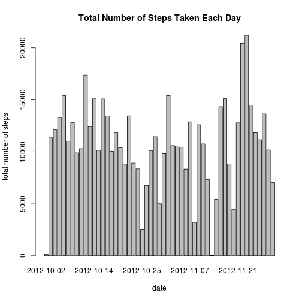

# Reproducible Research: Peer Assessment 1


## Loading and preprocessing the data

Read the data from activity.csv inside activity.zip into a datatable


```r

file <- unz("activity.zip", "activity.csv")
data <- read.csv(file, sep = ",", header = T, stringsAsFactors = F, colClasses = c("numeric", 
    "character", "numeric"))
```


Convert the data date field from type character to date 


```r
data$date <- as.Date(data$date, format = "%Y-%m-%d")
```


Save the data set as final


```r
final <- data
```


## What is mean total number of steps taken per day?

 dataset steps_per_day containing the sum of steps per day is created. NA values is skipped


```r

steps_per_day = aggregate(steps ~ date, sum, data = final, na.rm = T)
```


The following histogram shows the distribution of the number of steps taken per day.  


```r

barplot(steps_per_day$steps, names.arg = steps_per_day$date, xlab = "date", 
    ylab = "total number of steps", main = "Total Number of Steps Taken Each Day")
```

 


Alternative Interpretaion:

```r
hist(steps_per_day$steps, xlab = "total number of steps", main = "Number of steps per day", 
    breaks = 10)
```

 


Mean total number of steps per day:

```r
mean(steps_per_day$steps)
```

```
## [1] 10766
```

Median:

```r
median(steps_per_day$steps)
```

```
## [1] 10765
```


## What is the average daily activity pattern?


```r
avg_daily_activty = aggregate(steps ~ interval, mean, data = final, na.rm = T)

plot(avg_daily_activty, pch = 20, main = "Average Number of steps taken within 5 minute interval")

lines(avg_daily_activty)
```

 


The 5 min interval where the max number of steps is taken:


```r
avg_daily_activty[which.max(avg_daily_activty$steps), ]
```

```
##     interval steps
## 104      835 206.2
```


## Imputing missing values
Total number of missing values


```r
na_number = sum(is.na(final$steps))
na_number
```

```
## [1] 2304
```


Mean value for 5-min interval is used as a replacement for NA (strategy suggested in the guidelines)


```r

temp_final = merge(final, avg_daily_activty, by = "interval")

temp_final = temp_final[order(temp_final$date, temp_final$interval), ]

final$steps[is.na(final$steps)] = temp_final$steps.y[is.na(final$steps)]
rm(temp_final)
```


New plot of the total number of steps taken in each day


```r
avg_daily_activty = aggregate(steps ~ date, sum, data = final)
barplot(avg_daily_activty$steps, names.arg = avg_daily_activty$date, xlab = "date", 
    ylab = "total number of steps", main = "Total Number of Steps Taken Each Day")
```

 


Alternative Interpretaion:

```r
hist(avg_daily_activty$steps, xlab = "total number of steps", main = "Number of steps per day", 
    breaks = 10)
```

 


Mean total number of steps per day:

```r
mean(avg_daily_activty$steps)
```

```
## [1] 10766
```

Median:

```r
median(avg_daily_activty$steps)
```

```
## [1] 10766
```


The difference is that dataset became wider (higher in case of histogram). We filled in the days which were missed, but the information provided serves no new information, as overall picture remains the same. Mean and median remained at around the same place, since mean was used to impute NAs, and median was at the same place as mean for this dataset


## Are there differences in activity patterns between weekdays and weekends?


```r
final$weekdays = weekdays(final$date)

weekdays = aggregate(steps ~ interval, mean, data = final[!(final$weekdays %in% 
    c("Saturday", "Sunday")), ])
weekends = aggregate(steps ~ interval, mean, data = final[(final$weekdays %in% 
    c("Saturday", "Sunday")), ])

par(mfrow = c(2, 1))
plot(weekdays, pch = 20, main = "Weekdays")
lines(weekdays)
plot(weekends, pch = 20, main = "Weekends")
lines(weekends)
```

 


the plots have more activity spread throughout the day during weekends versus a spike in morning activity during the working day.

